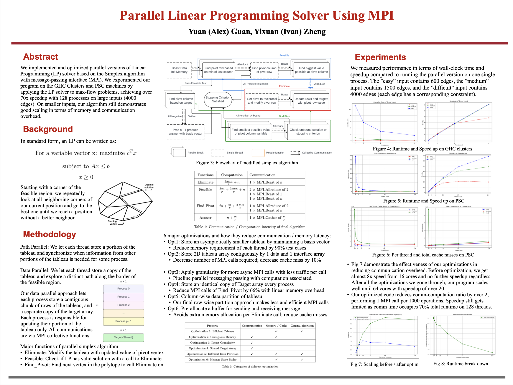

  <h1 align="center">Parallel Linear Programming Solver Using MPI</h1>
  

    <strong>Yuan (Alex) Guan</strong></a>
    ·
    <strong>Yixuan (Ivan) Zheng</strong></a>
     
    <a href="https://github.com/IvanLenn/15-418-Project/blob/main/report/418proposal.pdf"><strong>Project proposal</strong></a>
  

## SUMMARY
A parallel version of a parallel linear programming solver with MPI. We will parallelize Simplex algorithm in order to speed up the computation of linear programming solver. We plan to experiment on the GHC Clusters and PSC machines and perform analysis on the results. We'll probably study the parallelization of other LP algorithms such as interior point algorithms and Seidal's algorithm.

## BACKGROUND: 
Linear programming(LP) is a technique for the optimization of a linear objective function. The development of better and faster LP algorithms is an interesting ongoing area of research. 

The Simplex algorithm is a common method to solve LP. Starting with a corner of the feasible region, we repeatedly look at all neighboring corners of our current position and go to the best one. When we reach a position without better neighboring corners, it means we have found the optimal solution because the feasible region is convex.
    This algorithm can be greatly customized by large numbers of parameters and tolerances. We wish to speed up the algorithm using parallel techniques with message-passing.
     
    

## THE CHALLENGE: 
- Data Partitioning: Divide the constraints and objective function coefficients among MPI processes. Use data distribution techniques to distribute the data in a balanced way and minimize communication overhead. Locality can be a problem for LP algorithms dependent on the input constraints.

- Load Balancing: Implement load balancing work assignment methods to distribute the computational workload among MPI processes. This may involve dynamically redistributing data or adjusting the workload of each process based on its progress during the algorithm's execution. We'll experiment with different levels of dynamic assignment from static to fine-grained.

- Communication Optimization: Minimize communication overhead by aggregating data exchanges between processes using techniques such as batches and reducing the frequency of artifactual communication where possible.

- Parallelization Strategy: Explore different parallelization strategies, such as parallelizing different stages of the Simplex algorithm or parallelizing multiple independent Simplex iterations concurrently. We'll probably study the parallelization of other LP algorithms such as interior point algorithms and Seidal's algorithm.

## RESOURCES: 
- Type of computers: GHC for $\leq$ 8 cores. PSC for multi-cores experiments.
- We will probably use some existing code for the serial version implementation.
- We are going to implement the parallel version with MPI.

## GOALS AND DELIVERABLES: 
- Basic Goal:
    - A working serial version of simplex algorithm as benchmark script to measure performance
    - A working parallel version of simplex algorithm using MPI. We will use 2 different approaches and compare them:
        - One is to parallelize through multiple path searching: essentially we want to try different pivot selections in parallel and synchronize the current optimal solution periodically.
        - The other approach is to use a deterministic pivot selection strategy and divide the variables into chunks so that we can carry out parallel searching across chunks. In this way, we find the optimal solution iteratively.
- Ideal Goal:
    - Optimize our parallel linear programming solver further with following approaches:
        - Transfer technique from paper of parallel LP on shared memory address to our MPI.
        - Try different methods of distributing data to minimize communication-computation ratio. Ideally communication cost be negligible even with small variable and constraint size.
        -  Fine-tune our algorithm based on research into cache, communication, and load balancing analysis.
    - Apply our parallel Linear Programming Solver onto variable problems including solving nash, flow and operations research problems. Perform numerical analysis across different types and sizes of problems. We wish to achieve a 20x speedup on PSC machines with high thread counts (Past research using the shared memory approach has reached 19x speedup). 
- Extra Goal:
    - Implement different optimization for different LP inputs based on heuristics. Those may include:
        - Previous research demonstrates difficulties speeding up LP with sparse constraints (High variable count but low non-zero coefficients in constraints). We aims to try tackle those difficulties using MPI with scalable algorithm.
        - Add granularity or similar heuristics so that under small variables or number of constraints our algorithm still scales well.
      We hope to achieve an algorithm with over 40x speedup that scales well using MPI.
    - Adding heuristics to solve for integer linear programming and compare the performance with classic integer linear programming serial algorithm.

## PLATFORM CHOICE: 
- We’ll use GHC machines for 8-core CPU testing for experiments for our basic implementation. 
- We’ll also use PSC machines for experiments with multi-nodes.
- We'll C++ for this task, which is also appropriate since C++ has excellent support for MPI interface for parallel programming with MPI.

## POSTER

